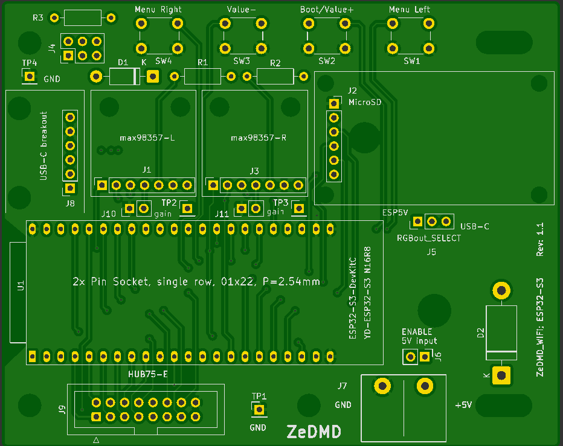
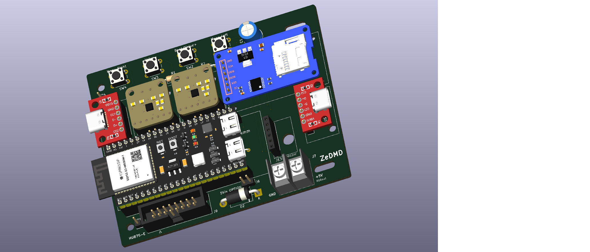

# ZeDMD_WiFi PCB
This is a carrier board for the ESP32-S3-DevKitC-1-N16R8 with the following features:
- ZeDMD compatible HUB75 connector for RGB Matrix Panels and 4 push-buttons
- 5V terminal block with 2 different use cases:
  - Output for the RGB panels, using power from USB-C (a jumper on J5 selects between the DevKit or USB-C breakout at J8)
  - Input for the DevKit, in case the RGB panels are on an external supply (jumper on J6)
- A socket (J2) for a Micro SD Card module. Note that this module needs to have a 5V - 3.3V regulator. Always check that the pinout of your module corresponds to the [schematics diagram](ZeDMD_WiFi/docs/ZeDMD_WiFi.pdf)
- Two sockets (J1 and J3) for MAX98357A amplifier modules (Adafruit i2s class-d mono-amp). A jumper on J4 selects between 3 power options (Devkit 3.3V, Devkit USB-C 5V, USB-C breakout at J8).
- A socket ()J8 for a USB-C breakout board for MAX98357A power. It can also be used if there is no other power source for the Devkit, or to power the RGB panels when selected by a jumper on J5.

## Power budget
The power supply voltage is +5V.

### USB-C limitation
The maximum current USB-C can deliver at 5V is 3A (Pmax = 15W). It does not matter that a USB-C PD port is able to deliver more power because that means using a higher voltage. This is not possible with this design!

### RGB matrix panel
Two 64x32 RGB matrix panels draw 5A (25W) at 100% intensity. Since these panels are designed for daylight operation, this intensity is really high. Usually no more than 50% is needed (2.5A, 12.5W). This leaves sufficient power (0.5A; 2.5W) for the DevKit and SD card.

### MAX98357A modules
The required power for the amplifiers depends on the supply voltage (3.3V or 5V) and the connected speakers. If there is insufficient power avalable, the supply may dip during loud sounds causing clipping at the output. This may damage the speakers. Also, the amplifiers have a volume dependent distortion which is less at 5V for the same volume.

#### Power needs for 2 MAX98357A modules:
| Vin | Rspeaker | Pout_max |    Iin (Pin)  |
| --- | -------- | -------- | ------------- |
| 3.3V| 8 ohm    | 0.9 W    | 0.6 A (2 W)   |
| 3.3V| 4 ohm    | 1.6 W    | 1.1 A (3.6 W) |
| 5V  | 8 ohm    | 1.8 W    | 0.9 A (4.5 W) |
| 5V  | 4 ohm    | 3.2 W    | 1.6 A (8 W)   |

### Power supply Recommendations
1. If USB-C is the preferred way to power everything: Then it is best to use the USB-C breakout power the RGB matrix panel (3W for the LED's); place a jumper at J5 2-3. A second USB-C cable on the DevKit powers the SD card and the amplifier modules; place a jumper at J4 3-4.
2. The best alternative is a 5V Meanwell (clone) switchmode power supply (SMPS). Connect the RGB matrix panels directly to this supply. If the DevKit is powered with USB-C there must be no jumpers on J5 & J6, the USB-C breakout is not needed, choose a 25V power supply in this case.
3. It is also an option to use a 5V SMPS for everything in case there is no USB-C connection. Then, J7 is used as the +5V supply input for the DevKit, SD card and amplifier modules. A 40W power supply feeds the RGB matrix panels directly, with an additional cable to J7. Place a jumper at J6, no jumper at J5!
*Note that options 2 and 3 allow full brighness of the RGB panels*

## Options
The general recommendation is: only mount the parts you will be using. So, if you don't need speaker outputs, don't mount the amplifier modules. If you don't use the push buttons, there is no need to mount them.

### RGBout at J7
Diode D2 will cause a voltage drop of 0.7 V to reduce voltage at the panels. The main reason is that some RGB panels do not work correctly at 5V. If the RGB panels work correctly at 5V, a wire bridge can be used instead of the diode.
A jumper on J5 is needed to select the power source.

### 5Vin at J7
As explained a jumper (or wire bridge) at J6 is only needed if the DevKit does not have an USB-C connection. In that case J7 becomes the 5V input.

### MAX_Vin
J4 selects the power source for the amplifier modules. The best option is a jumper between pins 3-4 (+5V from DevKit)

### MAX98357A gain
J10 and J11 can be used to select the amplifier gain. The default gain is 9dB if nothing is connected. For 12dB place a jumper or wire bridge. A 100k resistor can be placed for even more gain (15dB).
*Note that this only adjusts the volume, it will not increase the maximum output power.* TP2 and TP3 are connected to Vin. These testpoints are normally not needed. But these can be used to decrease the gain if needed...

## More information
[Licensed under the TAPR Open Hardware License (www.tapr.org/OHL)](LICENSE.txt)

[info](ZeDMD_WiFi/docs)

## Ordering
1. The Gerber and Drill files are [here](/KiCad/ZeDMD_WiFi/production.zip)
2. Example [ordering information](ZeDMD_WiFi/docs/ZeDMD_WiFi_JLCPCB_ordering.png)
