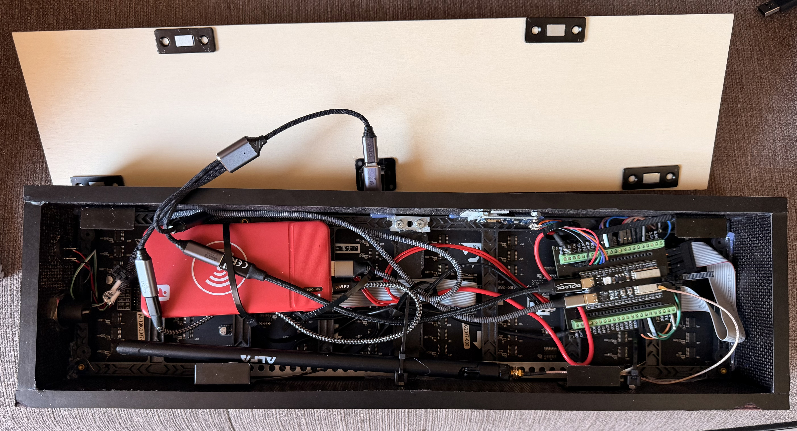

# ZeDMD 5.1.8 — WiFi Fork (128×32, ESP32-S3-N16R8)

---

> 🇩🇪 **Deutschsprachige Anleitung:** [LIESMICH.md](LIESMICH.md)

---

> 📝 *This README is a personal project diary rather than a complete guide. It documents what worked for me — your setup may differ. No claim to completeness; errors and omissions are possible.*

---

> **This is a personal hobby fork of [PPUC/ZeDMD](https://github.com/PPUC/ZeDMD) v5.1.8.**
> It is shared with the community in the hope that it might be useful — but it comes with **absolutely no support, no warranty, and no guarantee of any kind**.
> Issues and pull requests may not be responded to. Emails and messages regarding this project will likely go unanswered — not out of disrespect, but simply because this is a spare-time project maintained by one person.
> **Use entirely at your own risk.**

---

https://github.com/jens-b/ZeDMD-5.1.8-WIFI-128x32/raw/main/docs/images/ZeDMD_WiFi_128x32_demo.mp4

---

### Screenshots

| Clock + Weather | Weather Forecast | GIF Screensaver |
|:-:|:-:|:-:|
|  |  |  |

**Internals:**

---

## 🆕 What's new in this release

### Webradio
Stream internet radio stations directly through the ZeDMD's built-in speaker.
Requires a **MAX98357A I2S amplifier module** — see wiring below.

- Browser-based preset management at `/radio.html`
- Volume control via slider on the main page
- Station name and track title scroll on the LED matrix
- Presets survive firmware updates (stored in LittleFS)
- Stable station switching — no more audio dropout on channel change

### SDMMC Board Support
Added support for boards with an **onboard SD card via SDMMC interface** (1-bit mode) — no external SPI module required. See pin table below for the required HUB75 cable changes.

### Stability & Bug Fixes
This release includes a comprehensive overhaul of memory management and task safety:

- Fixed race condition on station switching — audio no longer reverts to the previous station
- Weather data (MQTT + HTTP) now safely synchronized between CPU cores
- SD card directory listing moved out of network callbacks — no more audio stuttering during web access
- Weather HTTP response buffered in PSRAM — eliminates large internal SRAM spike during fetch
- All file uploads are now atomic (`.tmp` + rename) — interrupted uploads no longer leave corrupt files
- `screensaverFiles` array protected by mutex against concurrent web access

---

## 🔜 Planned Features

### GIF Audio *(in preparation)*
Play an MP3 file from the SD card in sync with an animated GIF screensaver.
Place matching audio files in `/GifAudio/` on the SD card — the upload UI is already available on the main page.
The feature is **prepared in firmware** but not yet fully implemented and tested.

### Stereo Audio *(planned)*
Stereo output using **two MAX98357A modules** — one for the left channel, one for the right.

The SD pin is **not an active switch** — it is wired once and permanently fixed: Module L gets GND and always outputs the left channel; Module R gets 3.3V and always outputs the right channel. The ESP32 sends a stereo I2S stream and each module automatically filters its own channel — no firmware switching needed.

> ⚠️ Requires firmware change: the current build outputs mono I2S. The hardware wiring is the easy part — stereo I2S output in firmware is still to be implemented.

| MAX98357A Pin | ESP32-S3 | Notes |
|---------------|----------|-------|
| BCLK | **GPIO 9** | shared — both modules |
| LRC (WSEL) | **GPIO 14** | shared — both modules |
| DIN | **GPIO 21** | shared — both modules |
| SD — Module L | **GND** | permanently wired → always left channel |
| SD — Module R | **3.3V** | permanently wired → always right channel |
| VIN | **5V** | each module separately |
| GND | **GND** | each module separately |

---

## What's different from original ZeDMD

This fork is **WiFi-only** and targets the **ESP32-S3-N16R8** with a **128×32 LED matrix**.

### All added features

- **WiFi OTA firmware update** — flash new firmware directly via browser (`/admin.html`)
- **Screensaver** — GIF/RAW slideshow with clock and weather display (Open-Meteo)
- **Screensaver management** — favorites, ignore list, alphabetical/random order, strict timer, pause/resume
- **Improved web interface** — file management, per-file favorite/ignore buttons
- **Admin page** — WiFi, display, transport, MQTT, weather settings
- **Webradio** — internet radio via I2S amplifier (MAX98357A), preset management, volume control
- **Config Export/Import** — full configuration backup and restore via browser (`/config_transfer.html`)

---

## Hardware — ESP32-S3-N16R8 Note

### ⚠️ Missing 5V on VIN pin (IN-OUT solder bridge)

Some ESP32-S3-N16R8 boards do not provide 5V on the VIN pin out of the box.
If your ZeDMD powers up but the LED matrix stays dark or behaves unexpectedly, check the **IN-OUT solder bridge** near the 5V/GND pins.

**Fix:** Close the IN-OUT bridge with a small solder blob to route 5V from USB to the VIN pin.

> ⚠️ Modifying hardware is at your own risk!

For other known hardware issues and general ZeDMD documentation see the **[original ZeDMD README](https://github.com/PPUC/ZeDMD#readme)**.

---

## SD Card

The screensaver GIF/RAW files can be stored on a microSD card connected via SPI.

**Tested module:**
[Micro SD Card Module SPI (Amazon)](https://www.amazon.de/dp/B0D8Q8N7NQ)

**Wiring ESP32-S3-N16R8:**

| SD Module | ESP32-S3 Pin |
|-----------|-------------|
| VCC       | **3.3V** or **5V** ¹ |
| GND       | GND         |
| MISO      | GPIO 13     |
| MOSI      | GPIO 11     |
| SCK       | GPIO 12     |
| CS        | GPIO 10     |

> ¹ Most common SPI SD modules accept both 3.3V and 5V on VCC (they have an onboard regulator).
> Check your module's datasheet. If in doubt, use **3.3V** — the ESP32-S3 GPIO pins are **not** 5V-tolerant.

**Format:** FAT32, files in subfolders (e.g. `/MyGIFs/`). GIF and RAW files supported.

---

## Web Interface

Access via `http://<IP>/` (main page) and `http://<IP>/admin.html` (admin page).

### Admin page settings

| Section | Description |
|---------|-------------|
| **Firmware Update (OTA)** | Flash new firmware via browser — no USB needed |
| **WiFi** | SSID, password, port |
| **Display** | RGB order, scaling mode, brightness |
| **Transport** | USB / WiFi UDP / TCP / SPI, UDP delay, USB packet size |
| **Panel** | Clock phase, I2S speed, latch blanking, refresh rate, driver |
| **MQTT** | Server IP and port for weather integration |
| **Weather (Open-Meteo)** | Latitude/longitude for local weather display |
| **Update Web Files** | Upload index.html / admin.html without full filesystem flash |
| **Config Export/Import** | Full config backup/restore via `/config_transfer.html` |
| **Information** | Firmware version with build date, debug info |

---

## Pin Assignment ESP32-S3-N16R8

### HUB75 LED Matrix

| Signal | GPIO | Note |
|--------|------|------|
| R1 | 4 | |
| G1 | 5 | |
| B1 | 6 | |
| R2 | 7 | |
| G2 | 15 | |
| B2 | 16 | |
| A | 18 | |
| B | 8 | |
| C | 3 | |
| D | 42 | |
| E | 1 | only for 1/32 scan (64×64) |
| OE | 2 | |
| LAT | 40 | `wifi_sd_webradio` |
| LAT | **46** | `wifi_sdmmc_webradio` — rewire! |
| CLK | 41 | `wifi_sd_webradio` |
| CLK | **17** | `wifi_sdmmc_webradio` — rewire! |

> HUB75 LAT/CLK only need to be moved on the **SDMMC board**, because GPIO 40/41 are used internally for the SD card there.

### SD Card

| Signal | GPIO | Build |
|--------|------|-------|
| CS   | 10 | `wifi_sd_webradio` (SPI) |
| MOSI | 11 | `wifi_sd_webradio` (SPI) |
| SCK  | 12 | `wifi_sd_webradio` (SPI) |
| MISO | 13 | `wifi_sd_webradio` (SPI) |
| DATA | 40 | `wifi_sdmmc_webradio` (SDMMC onboard) |
| CLK  | 39 | `wifi_sdmmc_webradio` (SDMMC onboard) |
| CMD  | 38 | `wifi_sdmmc_webradio` (SDMMC onboard) |

### Buttons

| Function | GPIO |
|----------|------|
| UP       | 0  |
| DOWN     | 45 |
| FORWARD  | 48 |
| BACKWARD | 47 |

### Webradio (optional)

Requires a **MAX98357A I2S amplifier module** and a small speaker.

**Recommended:**
- Amplifier: MAX98357A breakout module (e.g. Adafruit #3006 or common clones)
- Speaker: **8 Ω / 3 W** — e.g. **Visaton FSR 7** (77 mm, excellent sound for the size)

### MAX98357A Wiring — identical for both builds

| MAX98357A Pin | ESP32-S3 | Notes |
|---------------|----------|-------|
| VIN           | **5V**       | 5V gives more headroom; 3.3V works but lower volume |
| GND           | GND          | |
| BCLK          | **GPIO 9**   | I2S Bit Clock |
| LRC (WSEL)    | **GPIO 14**  | I2S Word Select (L/R) |
| DIN           | **GPIO 21**  | I2S Data |
| GAIN          | **GND**      | GND = 15 dB gain (max); floating = 12 dB; 3.3V = 9 dB |
| SD (Shutdown) | 3.3V or floating | Floating = on; GND = mute |

> Class-D mono amplifier. Connect speaker to OUT+/OUT− only — **not** to GND (differential/BTL output).

### Build / Environment Overview

| Setup | Environment | Extra hardware |
|-------|-------------|----------------|
| Existing board + SPI SD module | `S3-N16R8_128x32_wifi_sd_webradio` | Connect MAX98357A |
| SDMMC board (onboard SD) | `S3-N16R8_128x32_wifi_sdmmc_webradio` | Connect MAX98357A + rewire HUB75 LAT/CLK |

### Webradio — Configuration

Open `http://<IP>/` after flashing — radio controls appear directly on the main page:

| Control | Description |
|---------|-------------|
| **▶ / ■** | Play last preset / Stop |
| **Station buttons** | Start a saved preset directly |
| **Volume** | Slider on the main page |
| **Display toggle** | Show/hide radio info on the LED matrix |

Full preset management at **`http://<IP>/radio.html`**.
Presets are stored in LittleFS (`/radio_presets.json`) and survive firmware updates.
Config transfer between boards: `http://<IP>/config_transfer.html`

---

## Weather (Open-Meteo)

Weather and 3-day forecast fetched from [Open-Meteo](https://open-meteo.com/) — free, no API key required.
Set your coordinates in `admin.html` → **Weather (Open-Meteo)**.

### ⚠️ Why HTTP, not HTTPS

The audio codec (MP3/AAC) occupies ~50 KB of internal SRAM at runtime. A TLS handshake needs an additional ~30–40 KB of contiguous internal SRAM — a guaranteed out-of-memory crash on the webradio build. Since Open-Meteo serves fully public weather data with no authentication tokens, plain HTTP is completely safe here.

> `http://api.open-meteo.com/v1/forecast` — explicitly supported by Open-Meteo for embedded/IoT devices.

---

## Installation

1. **First flash** (USB, one time only): PlatformIO → Upload (`S3-N16R8_128x32_wifi_sd_webradio`)
2. **Future firmware updates**: Browser → `http://<IP>/admin.html` → "Firmware Update (OTA)"
3. **Web interface updates**: Browser → `http://<IP>/admin.html` → "Update Web Files"

---

## Credits

- **[Markus Kalkbrenner / PPUC](https://github.com/PPUC/ZeDMD)** — original ZeDMD project
- **Niels (My Son)** — coding assistance & inspiration & moral support
- **[Claude Sonnet](https://anthropic.com)** — coding assistance

---

## Commercial Use

This project is licensed under GPL v2 — commercial use is permitted under those terms.
However, if you use this fork in a hardware product — whether commercial or a personal PCB build you're proud of — I'd love to receive **2 samples** as a thank-you: one for me, one for my son Niels. Not a legal requirement, just a friendly ask from a fellow hobbyist. 😊

---

## License

Same as the original project — see [LICENSE](LICENSE).
